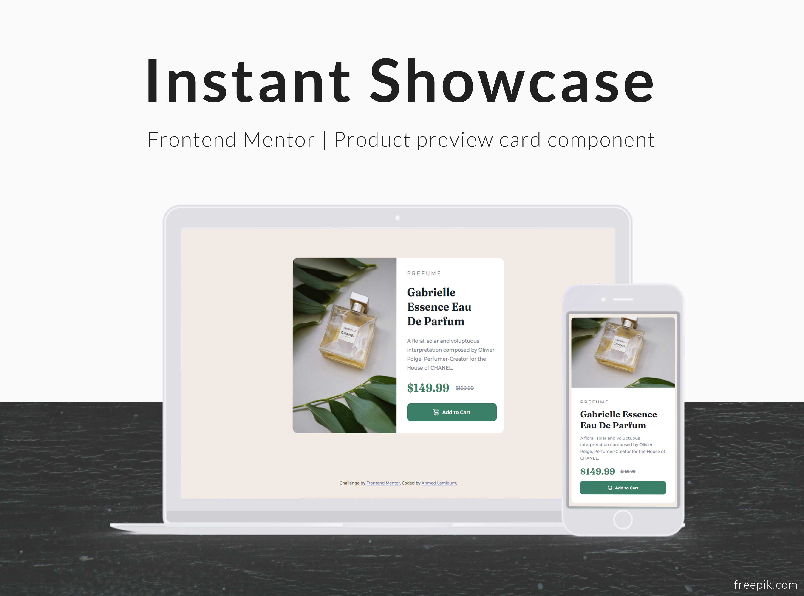

# Frontend Mentor - Product preview card component solution

This is a solution to the [Product preview card component challenge on Frontend Mentor](https://www.frontendmentor.io/challenges/product-preview-card-component-GO7UmttRfa). Frontend Mentor challenges help you improve your coding skills by building realistic projects.

### Screenshot

### Links

- Solution URL: [solution URL](https://github.com/a-lamloum/FM-Product-preview-card-component)
- Live Site URL: [live site](https://a-lamloum.github.io/FM-Product-preview-card-component/)

### Built with

- Semantic HTML5 markup
- CSS custom properties
- Flexbox
- Mobile-first workflow

## Author

- Website - [Portfolio](https://a-lamloum.github.io/react-portfolio)
- Frontend Mentor - [@a-lamloum](https://www.frontendmentor.io/profile/a-lamloum)
